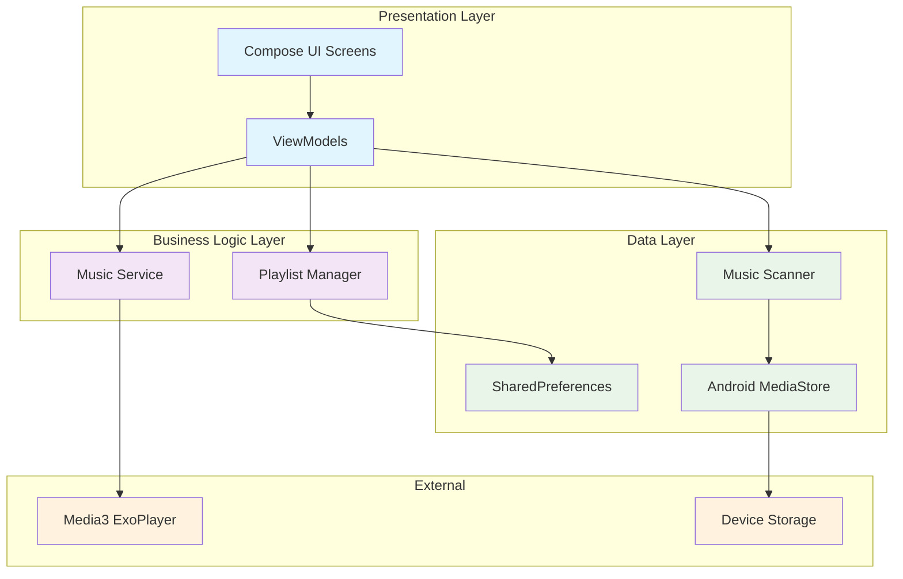
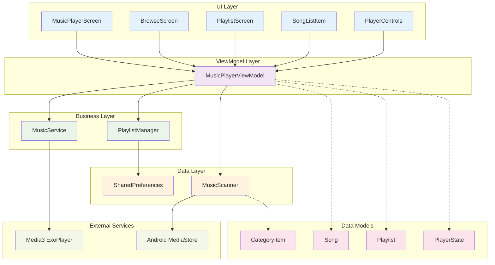
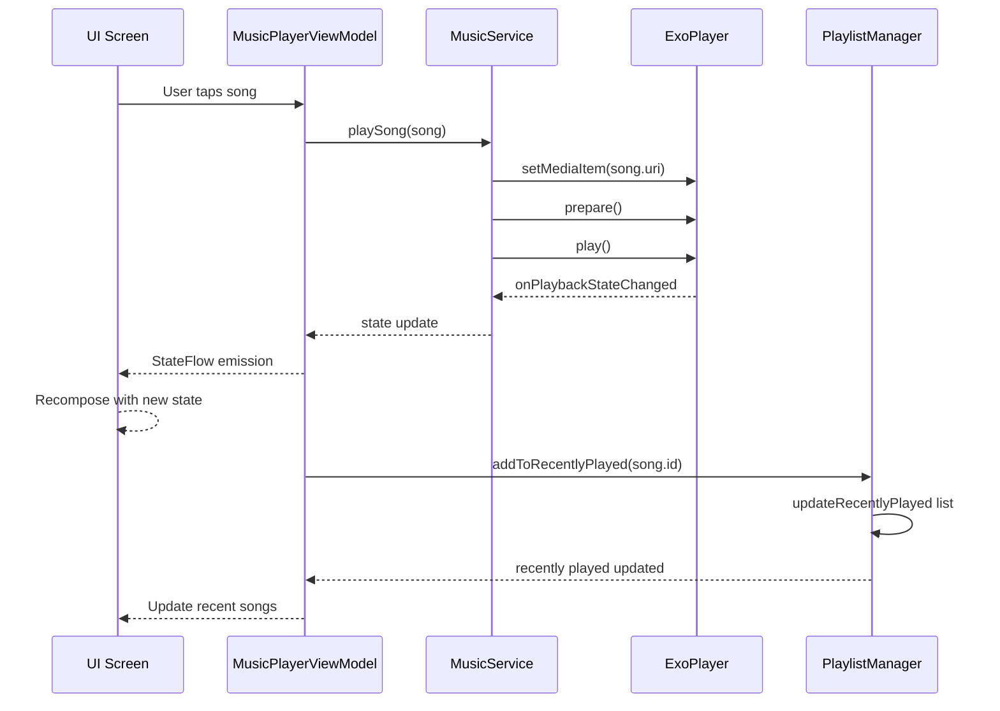

# 🏗️ Software Design & Architecture

This document provides a comprehensive overview of the Android Music Player's software architecture, design patterns, and component relationships. The app follows modern Android development practices with a clean, layered architecture.

## 📋 Table of Contents
- [Architecture Overview](#architecture-overview)
- [Layer Breakdown](#layer-breakdown)
- [Component Relationships](#component-relationships)
- [Data Flow](#data-flow)
- [State Management](#state-management)
- [Design Patterns](#design-patterns)
- [Key Components](#key-components)

---

## 🎯 Architecture Overview

The app follows the **MVVM (Model-View-ViewModel)** architectural pattern with **unidirectional data flow**, ensuring separation of concerns, testability, and maintainability.

### High-Level Architecture

The architecture consists of three main layers:
- **🎨 Presentation Layer**: Jetpack Compose UI + ViewModels
- **⚡ Business Logic Layer**: Services and Managers
- **💾 Data Layer**: Data sources and persistence



---

## 🏛️ Layer Breakdown

### 🎨 **Presentation Layer**

**Responsibility**: Handle user interactions and display data

#### Components:
- **Compose UI Screens**: Declarative UI built with Jetpack Compose
- **ViewModels**: Manage UI state and business logic coordination
- **UI Components**: Reusable composable functions

#### Key Files:
- `MusicPlayerScreen.kt` - Main player interface
- `BrowseScreen.kt` - Category browsing
- `PlaylistScreen.kt` - Playlist management
- `MusicPlayerViewModel.kt` - Primary state management
- UI Components: `SongListItem.kt`, `PlayerControls.kt`, etc.

#### Characteristics:
- **Stateless**: UI components don't hold state
- **Reactive**: Observes StateFlow from ViewModels
- **Declarative**: UI describes what should be displayed
- **Reusable**: Components can be composed together

### ⚡ **Business Logic Layer**

**Responsibility**: Core business operations and rules

#### Components:
- **MusicService**: Background audio playback management
- **PlaylistManager**: Playlist operations and persistence
- **Media Session**: System integration for media controls

#### Key Files:
- `MusicService.kt` - Media3 ExoPlayer integration
- `PlaylistManager.kt` - Playlist CRUD operations

#### Characteristics:
- **Stateful**: Manages application and playback state
- **Independent**: Can operate without UI layer
- **Async**: Uses coroutines for non-blocking operations

### 💾 **Data Layer**

**Responsibility**: Data access, storage, and retrieval

#### Components:
- **MusicScanner**: Reads music files from device storage
- **SharedPreferences**: Persistent storage for playlists
- **Data Models**: Represent domain entities

#### Key Files:
- `MusicScanner.kt` - MediaStore integration
- `Song.kt`, `Playlist.kt` - Data models
- `PlaybackState.kt` - State representations

#### Characteristics:
- **Single Source of Truth**: Centralized data management
- **Persistent**: Data survives app restarts
- **Efficient**: Optimized queries and caching

---

## 🔄 Component Relationships

This diagram shows how the major components interact with each other:



### Key Relationships:

#### **UI → ViewModel**
- All UI components interact exclusively with the ViewModel
- No direct access to business logic or data sources
- Unidirectional data flow from ViewModel to UI

#### **ViewModel → Business Layer**
- ViewModel coordinates between multiple business components
- Manages complex operations like playlist creation, song playback
- Handles state synchronization across different managers

#### **Business → Data Layer**
- Each business component has specific data responsibilities
- MusicService manages playback state
- PlaylistManager handles persistent playlist data

---

## 🌊 Data Flow

### User Interaction Flow

Here's how data flows when a user plays a song:



### Data Flow Principles:

1. **Unidirectional**: Data flows down, events flow up
2. **Reactive**: UI automatically updates when state changes
3. **Single Source of Truth**: ViewModel holds the canonical state
4. **Immutable State**: State objects are immutable for predictability

---

## ⚡ State Management

### StateFlow Architecture

The app uses **StateFlow** for reactive state management:

#### **State Holders:**
```kotlin
// In MusicPlayerViewModel
private val _songs = MutableStateFlow<List<Song>>(emptyList())
val songs: StateFlow<List<Song>> = _songs.asStateFlow()

private val _playerState = MutableStateFlow(PlayerState())
val playerState: StateFlow<PlayerState> = _playerState.asStateFlow()

private val _playlists = MutableStateFlow<List<Playlist>>(emptyList())
val playlists: StateFlow<List<Playlist>> = _playlists.asStateFlow()
```

#### **State Consumption:**
```kotlin
// In Composable functions
val songs by viewModel.songs.collectAsState()
val playerState by viewModel.playerState.collectAsState()
```

### State Types:

#### **1. UI State**
- **Purpose**: Represents what the UI should display
- **Examples**: Loading states, error messages, current screen
- **Scope**: Single screen or component

#### **2. Application State**
- **Purpose**: Shared across multiple screens
- **Examples**: Current song, playlist, user preferences  
- **Scope**: Entire application

#### **3. Playback State**
- **Purpose**: Audio playback status
- **Examples**: Playing/paused, current position, shuffle mode
- **Scope**: Media session and UI

### State Management Benefits:

- **Predictable**: State changes are traceable and deterministic
- **Testable**: Easy to test state transitions in isolation
- **Performant**: Only affected components recompose
- **Consistent**: Same state everywhere in the app

---

## 🔧 Design Patterns

### 1. **MVVM (Model-View-ViewModel)**

**Purpose**: Separation of UI logic from business logic

#### Implementation:
- **Model**: `Song`, `Playlist`, `PlayerState` data classes
- **View**: Jetpack Compose UI components
- **ViewModel**: `MusicPlayerViewModel` managing state and coordination

#### Benefits:
- **Testability**: Business logic can be tested without UI
- **Maintainability**: Clear separation of concerns
- **Reusability**: ViewModels can be reused across different UIs

### 2. **Repository Pattern**

**Purpose**: Abstraction layer for data access

#### Implementation:
- **`MusicScanner`**: Repository for music file data
- **`PlaylistManager`**: Repository for playlist persistence

#### Benefits:
- **Single Source of Truth**: Centralized data management
- **Abstraction**: UI doesn't know about data sources
- **Flexibility**: Easy to change data sources

### 3. **Observer Pattern**

**Purpose**: Reactive updates when data changes

#### Implementation:
- **StateFlow**: Observable state streams
- **Compose**: Automatic recomposition on state changes
- **Media3**: Callback-based playback state updates

#### Benefits:
- **Reactive**: UI automatically updates
- **Decoupled**: Components don't need direct references
- **Efficient**: Only affected parts update

### 4. **Dependency Injection (Manual)**

**Purpose**: Manage component dependencies

#### Implementation:
```kotlin
class MusicPlayerViewModel(application: Application) : AndroidViewModel(application) {
    private val context = getApplication<Application>()
    private val musicScanner = MusicScanner(context)
    private val playlistManager = PlaylistManager(context)
    // Dependencies injected through constructor
}
```

#### Benefits:
- **Testability**: Easy to mock dependencies
- **Flexibility**: Can swap implementations
- **Single Responsibility**: Each component has focused purpose

### 5. **State Pattern**

**Purpose**: Manage different playback states

#### Implementation:
```kotlin
enum class PlaybackState {
    STOPPED, PLAYING, PAUSED, LOADING, ERROR
}
```

#### Benefits:
- **Clear States**: Explicit representation of system states
- **Predictable**: Well-defined state transitions
- **Debuggable**: Easy to track state changes

---

## 🔑 Key Components

### **MusicPlayerViewModel**
**Role**: Central state coordinator and business logic manager

#### Responsibilities:
- **State Management**: Maintains all UI-related state
- **Coordination**: Orchestrates between different managers
- **Business Logic**: Implements user workflows
- **Lifecycle**: Manages component lifecycles

#### Key Methods:
```kotlin
fun playSong(song: Song)
fun createPlaylist(name: String, description: String)
fun toggleFavorite(songId: Long)
fun getCategorySongs(category: BrowseCategory, itemId: String)
```

### **MusicService**
**Role**: Background audio playbook management

#### Responsibilities:
- **Media Playback**: Controls ExoPlayer for audio playback
- **Media Session**: Integrates with Android's media system
- **Notifications**: Shows playback controls in notification
- **Background Processing**: Continues playback when app is backgrounded

#### Key Features:
- **Media3 Integration**: Professional-grade audio engine
- **System Integration**: Works with Bluetooth, headphone controls
- **Notification Controls**: Standard media notification

### **MusicScanner**
**Role**: Audio file discovery and metadata extraction

#### Responsibilities:
- **File Discovery**: Scans device storage for audio files
- **Metadata Extraction**: Reads ID3 tags and file information
- **Category Organization**: Groups files by artist, album, genre
- **Performance**: Efficient scanning with background processing

#### Key Methods:
```kotlin
suspend fun scanForAudioFiles(): List<Song>
suspend fun getAllArtists(): List<CategoryItem>
suspend fun getAllGenres(): List<CategoryItem>
```

### **PlaylistManager**
**Role**: Playlist persistence and management

#### Responsibilities:
- **CRUD Operations**: Create, read, update, delete playlists
- **Persistence**: Save playlists to local storage
- **Data Integrity**: Ensure playlist consistency
- **Performance**: Efficient serialization/deserialization

#### Storage Strategy:
- **Format**: JSON serialization with kotlinx.serialization
- **Location**: Android SharedPreferences for reliability
- **Structure**: Playlists store song ID references, not duplicates

---

## 🏗️ Architecture Benefits

### **Maintainability**
- **Clear Structure**: Easy to locate and modify code
- **Separation of Concerns**: Each component has single responsibility
- **Documentation**: Well-documented interfaces and behaviors

### **Testability**
- **Unit Testing**: Business logic can be tested in isolation
- **Mocking**: Dependencies can be easily mocked
- **Deterministic**: State changes are predictable

### **Scalability**
- **Modular Design**: New features can be added without major changes
- **Performance**: Efficient rendering and data management
- **Extensibility**: New data sources or UI components easily integrated

### **User Experience**
- **Responsive**: Reactive UI with smooth animations
- **Reliable**: Robust error handling and recovery
- **Intuitive**: Consistent interaction patterns

---

## 🚀 Performance Considerations

### **Memory Management**
- **Lazy Loading**: Songs loaded on-demand
- **State Efficiency**: Immutable state objects prevent memory leaks
- **Image Caching**: Coil handles album artwork caching

### **Background Processing**
- **Coroutines**: Non-blocking operations for file scanning
- **Background Service**: Music continues playing when app is closed
- **Efficient Queries**: Optimized MediaStore queries

### **UI Performance**
- **Compose Optimizations**: Smart recomposition
- **Lazy Lists**: Efficient rendering of large song lists
- **State Hoisting**: Prevents unnecessary recompositions

---

This architecture provides a solid foundation for a professional-grade music player application, balancing functionality, performance, and maintainability.
